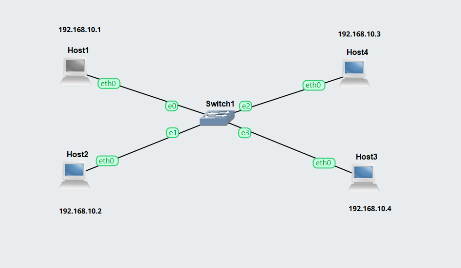
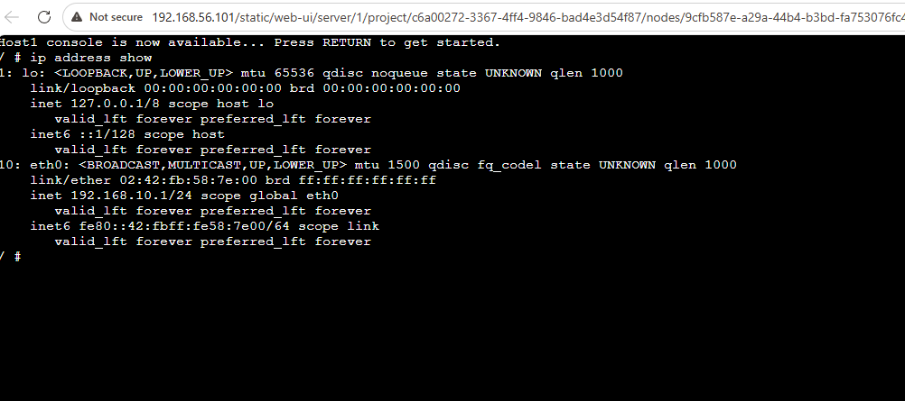
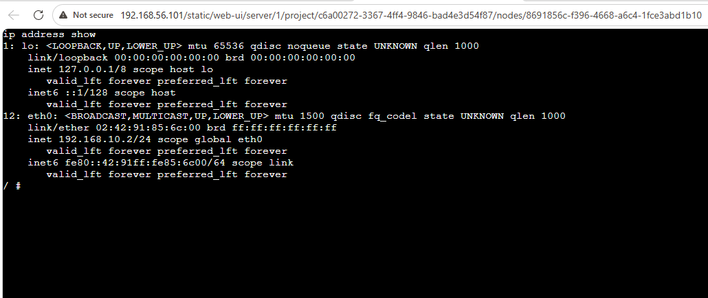
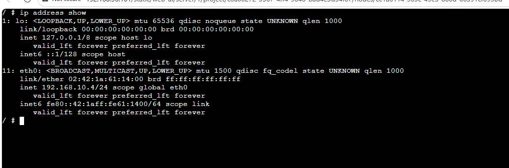
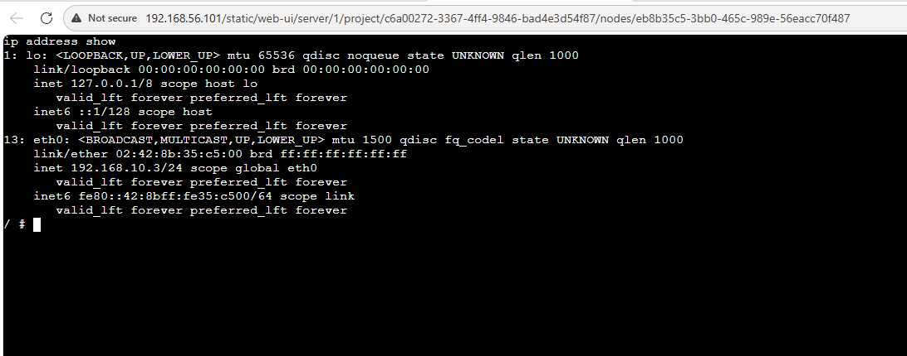
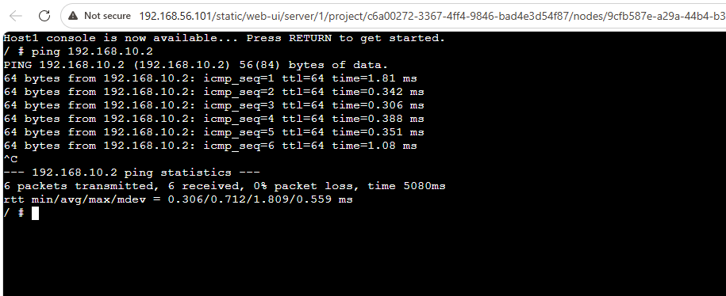
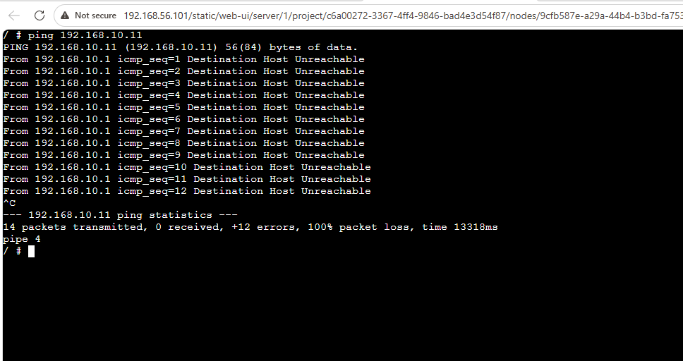
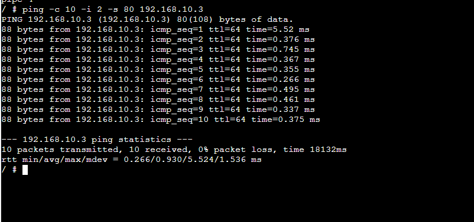

## Task 1: Setting Static IP Addresses
### Aim 

Three different approaches to set static IP address on a Linux host.

## Outputs
## 1. Exported Projects
[Setting IP GNS3 Project](./Images/Setting-IP-12317923.gns3project)

## 2.	Screenshot of the network

## 3. Screenshot of the console of each of the four hosts
### Host1:

### Host2:

### Host3:

### Host4:

## Task 2: Testing Network Connectivity and Delay with Ping
### Aim

Learn the basics of ping to test if a device is reachable and to measure delay

## Outputs
## 1.	Screenshot of the console of one host showing the ping command output when no options are used (include the ping command you typed in as well as the summary information).

- Target: 192.168.10.2
- Packets: 6 sent, 6 received (0% loss)
##### Latency:
- Min: 0.306 ms
- Avg: 0.712 ms
- Max: 1.809 ms
- Status: Connection is stable and healthy with very low latency.
  
## 2.	Screenshot showing the ping command (and output) to a wrong IP address
Here, we ping to a wrong Ip which is not in our network:

## 3.	Screenshot showing the ping command (and output) when limiting the count, setting the data size and interval to non-default values

-- ping 192.168.10.3 statistics --

10 packets transmitted, 10 received, 0% packet loss, time 18132ms

rtt .266 
icmp_seq=1, ttl 64
