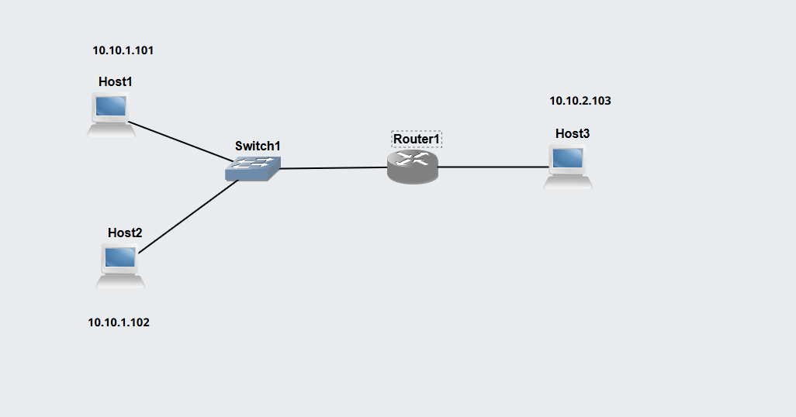
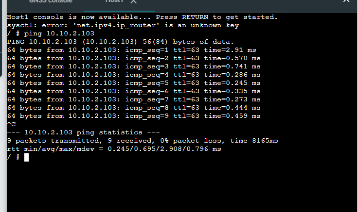
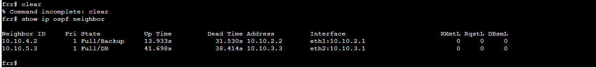
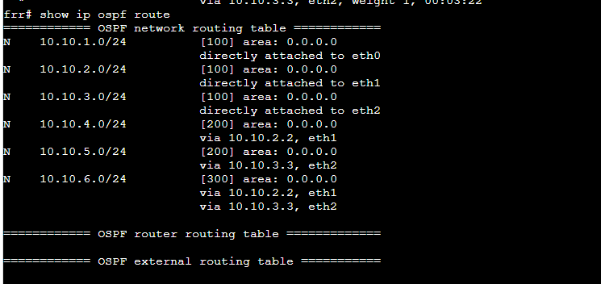
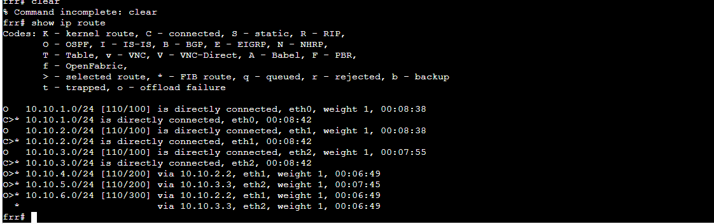
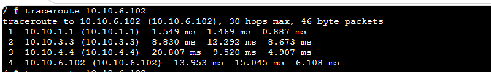

## Task 1: View Routing Tables 
### Aim
Learn how to view routing tables and enable forwarding on a router. 

### Outputs
### 1.	Exported project
[View Routes](./Images/View-Routes-12317923.gns3project)

### 2.	Screenshot of the network

### 3.	Record of the IP addresses and routing tables of each host and router. 
### IP Address Summary

#### Subnet A: 10.10.1.0/24

- Host1:   10.10.1.101   Gateway: 10.10.10.1
- Host2:   10.10.1.102    Gateway: 10.10.10.1
- Router:  10.10.1.1 (eth0)

#### Subnet B: 10.10.2.0/24

- Router:  10.10.2.1 (eth1)
- Host3:   10.10.2.103   Gateway: 10.10.2.1

#### Routing Table
- Host 1
  
default via 10.10.1.1 dev eth0

10.10.1.0/24 dev eth0 scope link src 10.10.1.101

- Host2
  
default via 10.10.1.1 dev eth0

10.10.1.0/24 dev eth0 scope link src 10.10.1.102

- Host 3
  
default via 10.10.2.1 dev eth0

10.10.2.0/24 dev eth0 scope link src 10.10.2.103

- Router 1
  
  10.10.1.0/24 dev eth0 scope link src 10.10.1.1
  
  10.10.2.0/24 dev eth0 scope link src 10.10.2.1

### 4.	Screenshot of a successful ping from a host one one subnet to a host on the other subnet

## Task 1: View Routing Tables 
### Aim
Observe how dynamic routing is setup and handles network changes

### Outputs
### 1.	Exported project
[View OSPF Basics](./Images/OSPF-Basics-12317923.gns3project)

### 2.	Screenshot of the network

### 3.	Output showing neigbour routers of FRR1

### 4.	Output showing routing table for two routers.

### 5.	A table that summarises the routers for all routers (with a column for Destination and a column for Next Node).

### 6.	Output of traceroute commands before and after the link is disconnected (by stopping the NETem node)
-This is the screenshot before link breaks:

- This is the screenshot after the link breaks:
f

