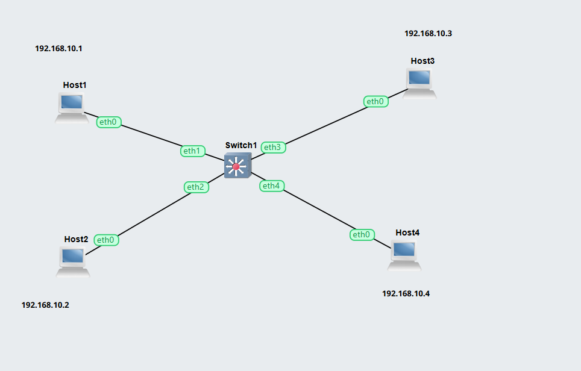
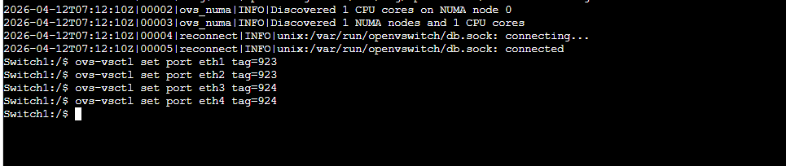
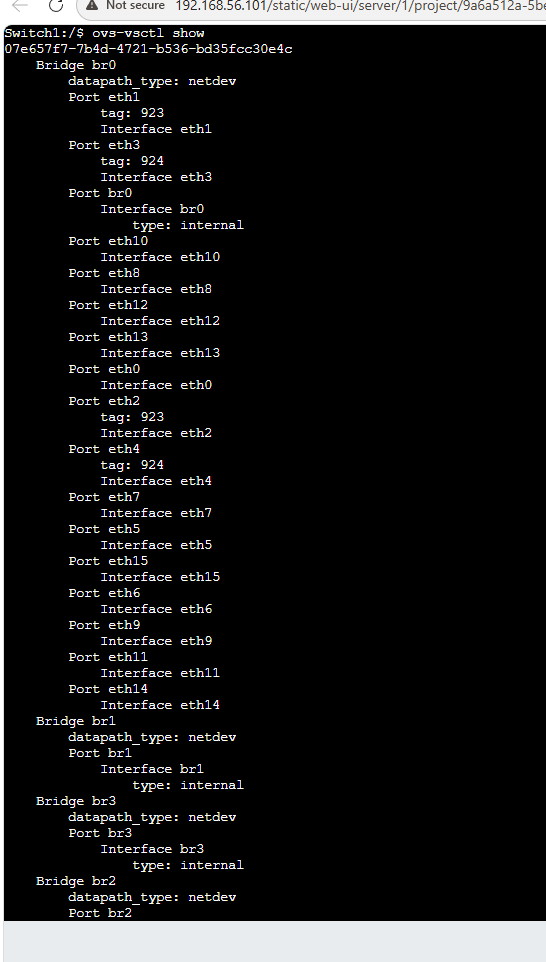
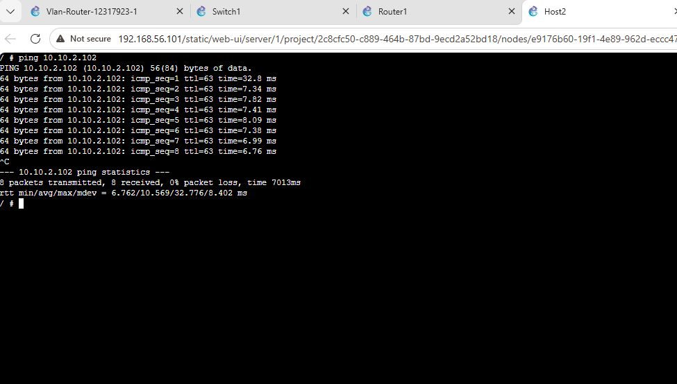
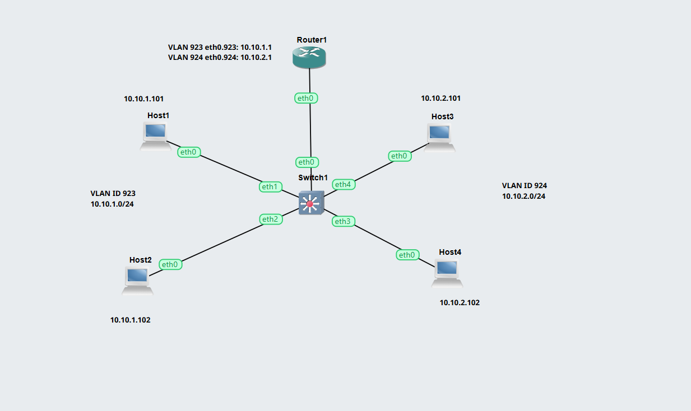
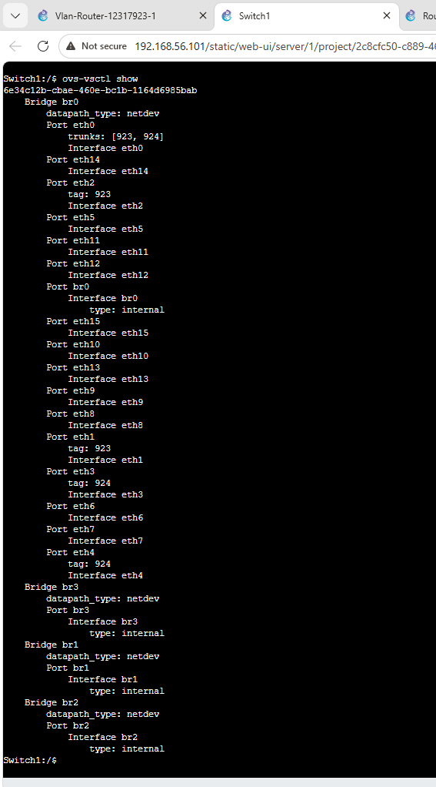

## Task 1: Setup VLANs on Switch 
### Aim 

- Learn to configure VLANs on a managed switch 

### Outputs
### 1.	Exported project
[VLANs Setup on Switch](./Images/Vlan-Basics-12317923.gns3project)

### 2.	Screenshot of the network

### 3.	Screenshot showing the ports and tags on the switch

## Task 2: Setup VLANs on a Router 
### Aim 
Configure VLANs on a Router and enable forwarding between VLANs on a managed switch 

### Outputs 
### 1.	Exported project
[Setup VLANs on a Router](./Images/Vlan-Router-12317923.gns3project)

### Screenshot showing the ping from One VLAN to another Vlan

### 2.	Screenshot of the network

### 3.	Screenshot showing the ports and tags on the switch

