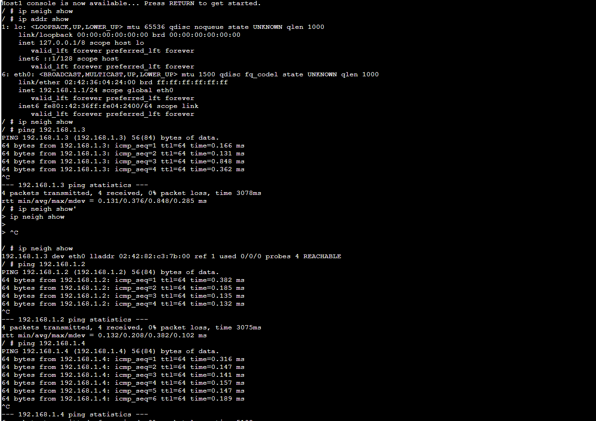
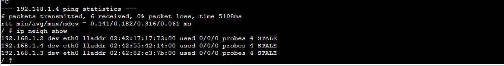
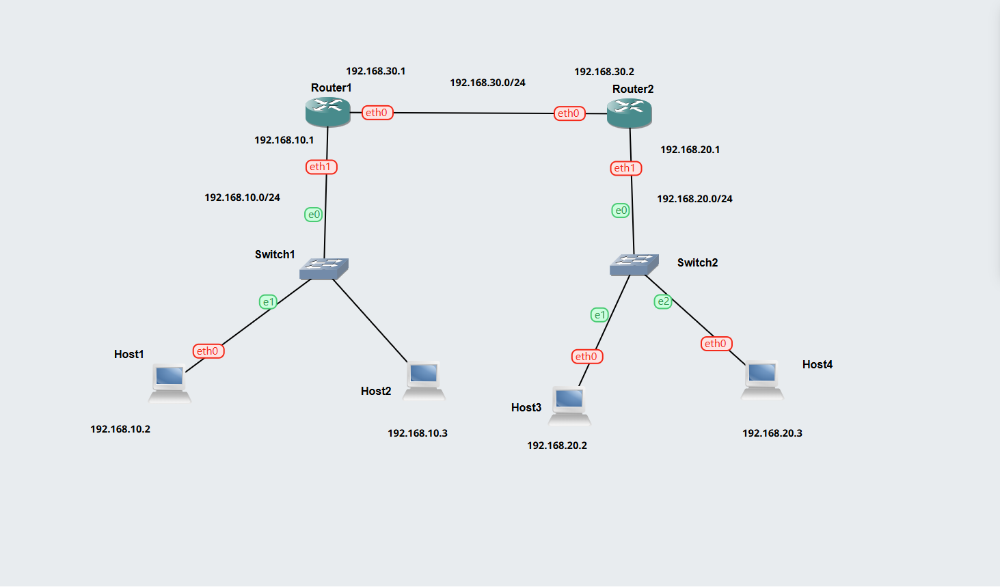
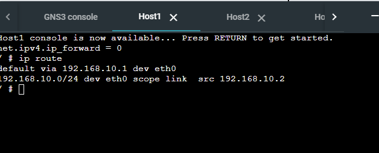
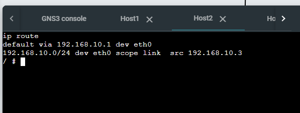
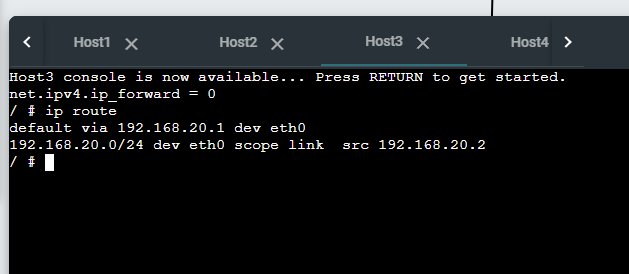
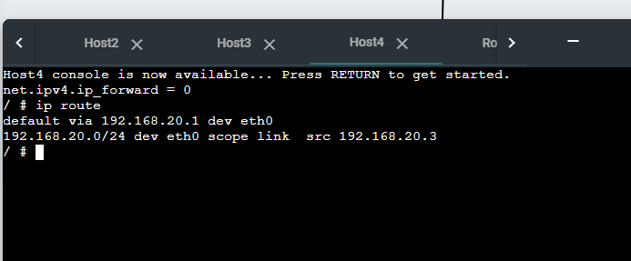
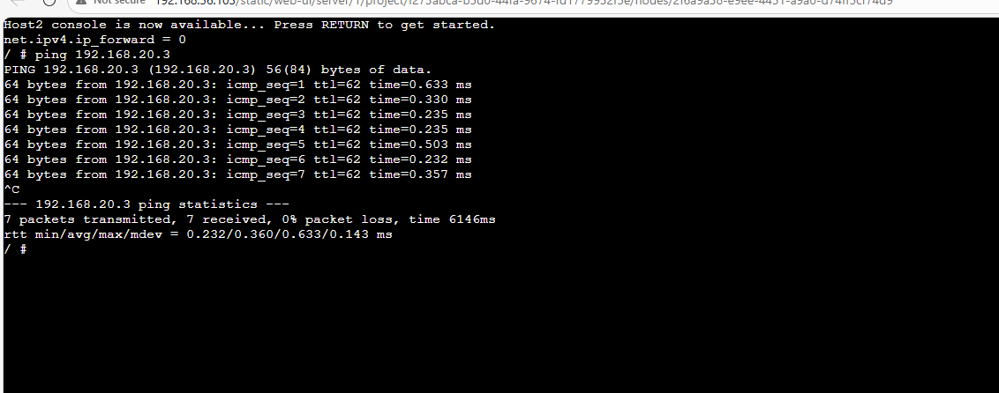

## Task 1: Resolving IP Addresses to Hardware Addresses
### Aim 

- See how ARP allows devices to keep track of mapping from IP addresses to hardware addresses in a LAN.

### Outputs
### 1. Screenshots of ARP tables of host A at different time points that illustrate the changes in the ARP table as devices communicate. 

## Task 2: Default Gateways  

### Aim  

- Use default gateways to enable static routing

### Outputs  

### 1. Exported project
[Default Gateways](./Images/Default-Gateway-12317923.gns3project)

### 2. Screenshot of the network

### 3. Record of the IP addresses and routing tables of each host and router. This can either be one or more screenshots, or copy-and-paste of values, or summarising the values in a diagram.  

 Here, I am summarising the values in a diagram by showing all record of the IP addresses and routing tables of each host and router

 

### 4. Screenshot of a successful ping from a host one one subnet to a host on the other subnet

